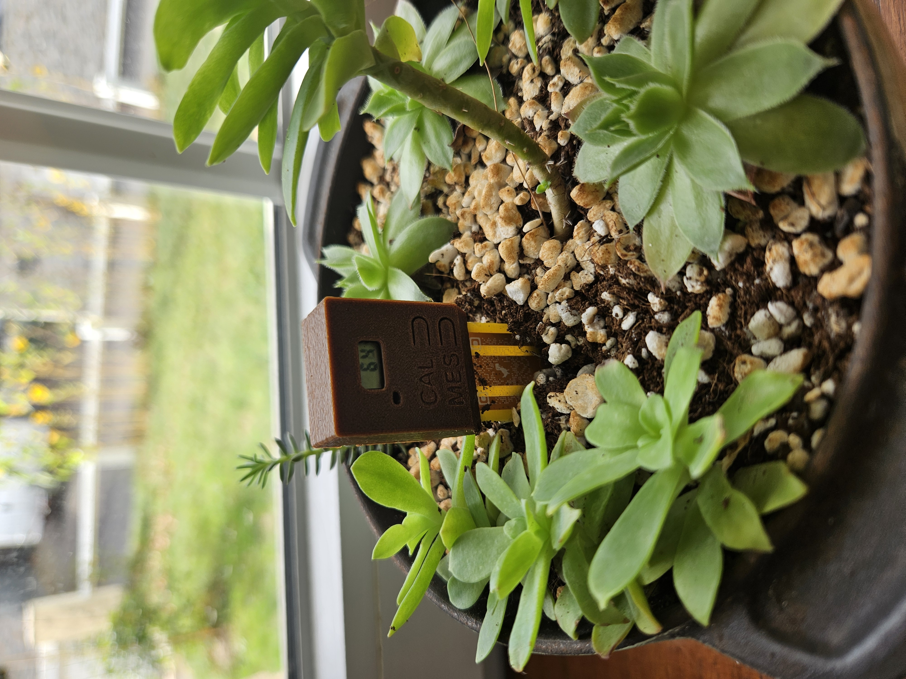
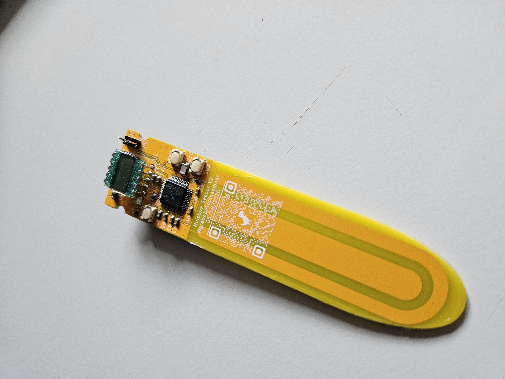

# 🌿 Capacitive Soil Moisture Sensor

A complete **open-source capacitive soil moisture sensor project** based on the **STM32U073CB** microcontroller.

This repository contains all resources for the project:
* 📐 **3D Design**: Modular enclosure for 3D printing.
* 🔌 **Electronics (V1 & V2)**: KiCad files, Gerbers, BOM, PDF schematics, and 3D models.
* 💻 **Firmware**: C/C++ source code optimized for STM32 (STM32CubeIDE / STM32CubeMX project).
* 📖 **Documentation**: User manual and component datasheets.

---

## 🖼️ Project Overview

| Complete Enclosure | Assembled PCB |
| :---: | :---: |
|  |  |

---

## 📂 Project Structure

```text
Moisture-sensor/
├── 3D_design/                             # CAD files for 3D printing
│   ├── moisture_sensor_capot.3mf         # Main top cover (3MF)
│   ├── moisture_sensor_capot_ecran.stl   # Top cover with display cutout (STL)
│   └── moisture_sensor_capot_pile.stl    # Battery hatch / compartment (STL)
│
├── Electronics/                           # Electronics design files
│   ├── datasheet/                         # Component datasheets
│   ├── Moisture_sensorV1/                 # First revision
│   └── Moisture_sensorV2/                 # Revision V2 (Main)
│       ├── 3D_model/                      # Complete PCB 3D STEP model
│       ├── BOM/                           # Bill of Materials (BOM)
│       ├── gerber_file/                   # Gerber files for PCB manufacturing
│       ├── KICAD/                         # KiCad CAD project (Schematics + PCB)
│       └── pdf_version/                   # Schematics in PDF format
│
├── Program/                               # Firmware & Source code
│   └── STM32U073CB/                       # STM32CubeIDE / CubeMX project
│       ├── Core/                          # Application source code (Inc, Src, Main)
│       ├── Drivers/                       # STM32 HAL and CMSIS drivers
│       ├── Capacitive_Moisture_sensor.ioc # STM32CubeMX configuration
│       ├── Capacitive_Moisture_sensor Debug.launch # Debug launch configuration
│       └── STM32U073CBTX_FLASH.ld         # Flash linker script
│
├── pictures/                              # Project pictures
│   ├── moisture_sensor.jpg
│   └── populated_PCB.jpg
│
├── Moisture_sensor_User_Manual.pdf        # Complete user manual (PDF)
├── Moisture_sensor_User_Manual.odt        # Editable user manual (ODT)
└── README.md                              # Main repository documentation

---

## ⚡ Technical Specifications

* **Microcontroller**: STM32U073CB (Ultra-low-power ARM Cortex-M0+).
* **Measurement Technology**: Capacitive (corrosion-resistant compared to resistive sensors).
* **PCB Design**: Designed with **KiCad** (V2 revision available with production-ready Gerber files).
* **Power Supply**: Designed for battery operation with a quick-access hatch.
* **Display (Optional)**: Screen support using the custom top cover.

---

## 🖨️ 3D Printed Enclosure

Parts are located in the `3D_design/` directory.

| Part | Format | Description |
| :--- | :--- | :--- |
| `moisture_sensor_capot.3mf` | `.3mf` | Standard solid top cover |
| `moisture_sensor_capot_ecran.stl` | `.stl` | Top cover with cutout for display integration |
| `moisture_sensor_capot_pile.stl` | `.stl` | Battery compartment housing / cover |

---

## 💻 Firmware & Development

Source code is located in `Program/STM32U073CB/`.

### Prerequisites
* [STM32CubeIDE](https://www.st.com/en/development-tools/stm32cubeide.html) (recent version)
* Programmer / Debugger (ST-Link V2 / V3)

### Building and Flashing
1. Open **STM32CubeIDE**.
2. Import the project from `Program/STM32U073CB`.
3. If you wish to modify pinout or peripheral configurations, open `Capacitive_Moisture_sensor.ioc` with STM32CubeMX.
4. Build (`Build Project`) then flash the microcontroller using the included debug configuration (`Capacitive_Moisture_sensor Debug.launch`).

---

## 🏭 PCB Manufacturing (Hardware V2)

To manufacture the V2 PCB:
1. Production-ready manufacturing files (JLCPCB, PCBWay, etc.) are located in `Electronics/Moisture_sensorV2/gerber_file/`.
2. The Bill of Materials (BOM) for soldering is available in `Electronics/Moisture_sensorV2/BOM/`.
3. Schematics can be viewed in KiCad or directly in `Electronics/Moisture_sensorV2/pdf_version/`.

---

## 📖 User Manual

To learn more about calibration, installation, and daily usage of the sensor, refer to:
📄 [Moisture_sensor_User_Manual.pdf](Moisture_sensor_User_Manual.pdf)

---

## 📜 License

This project is released under an open-source license. You are free to use, modify, and distribute it.
